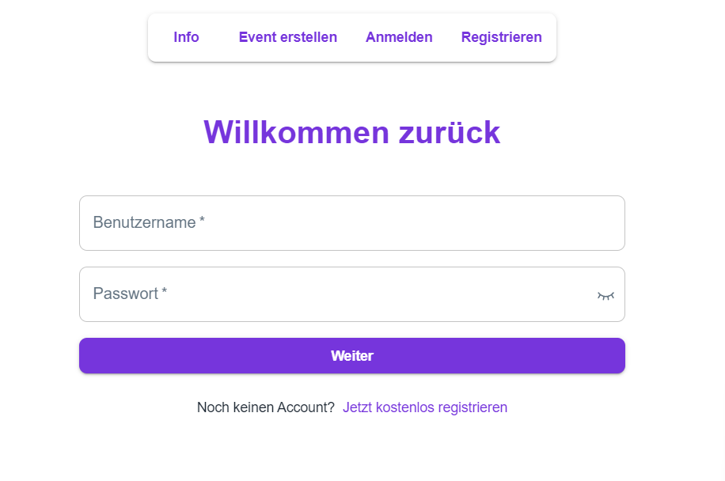
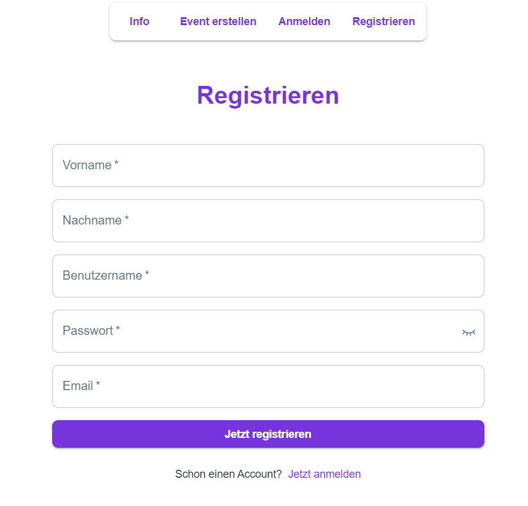
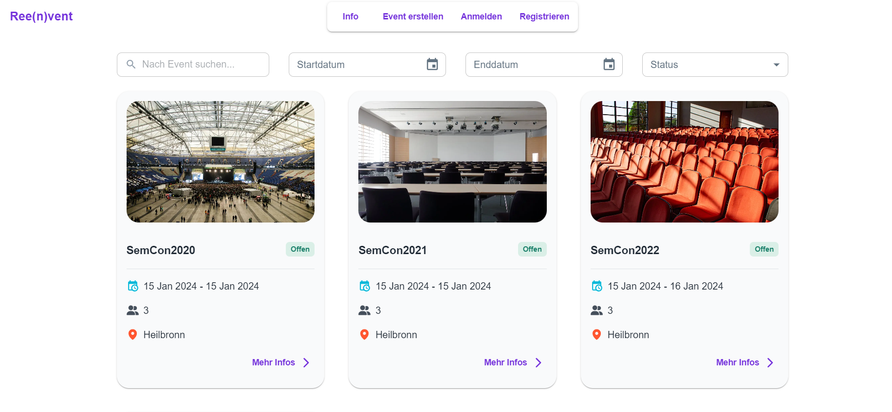
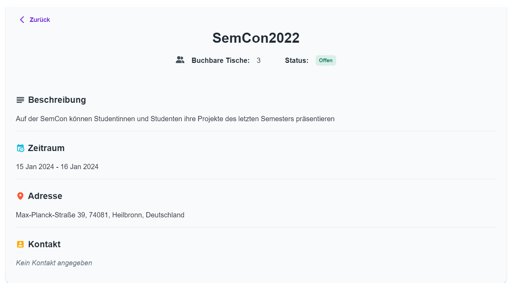
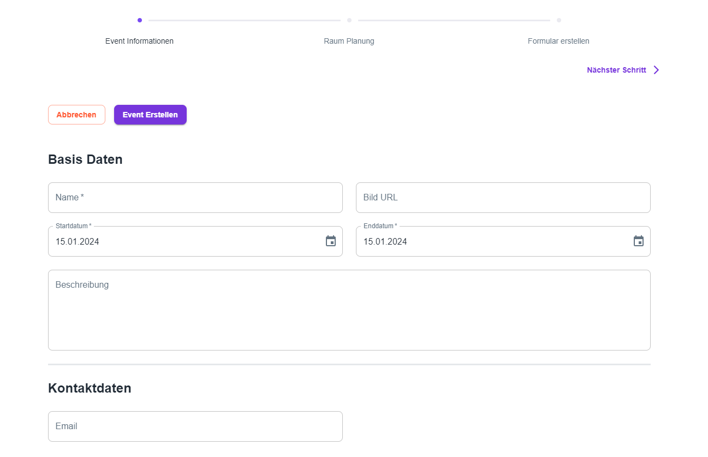
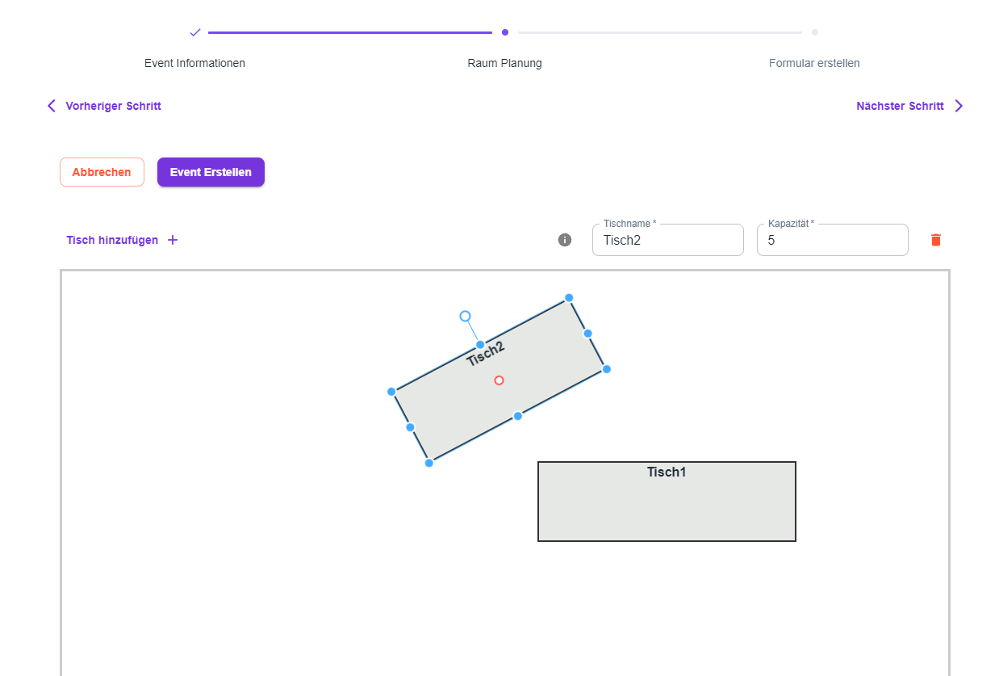
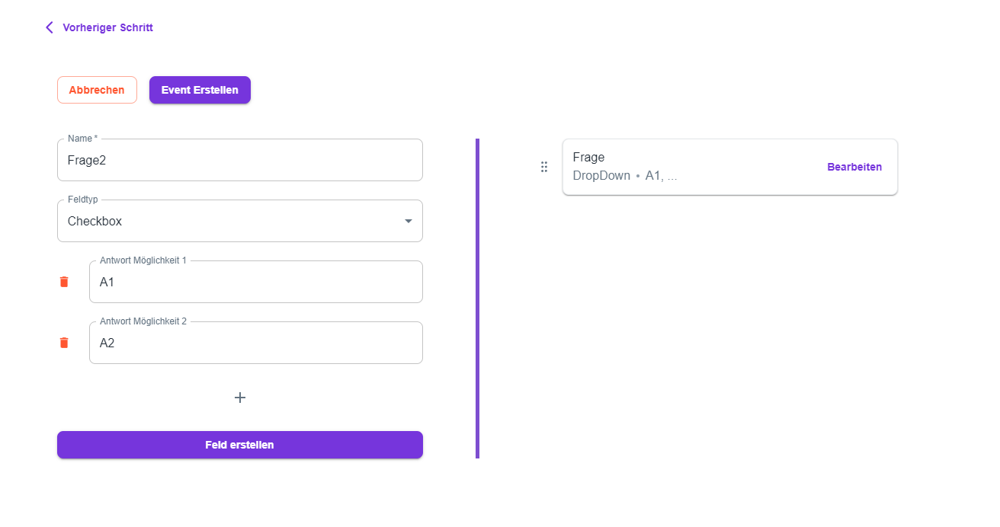
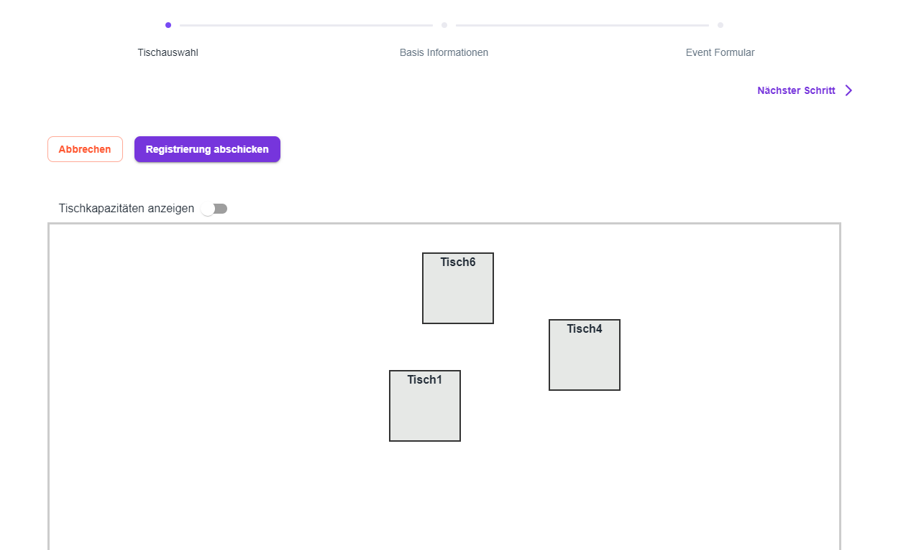
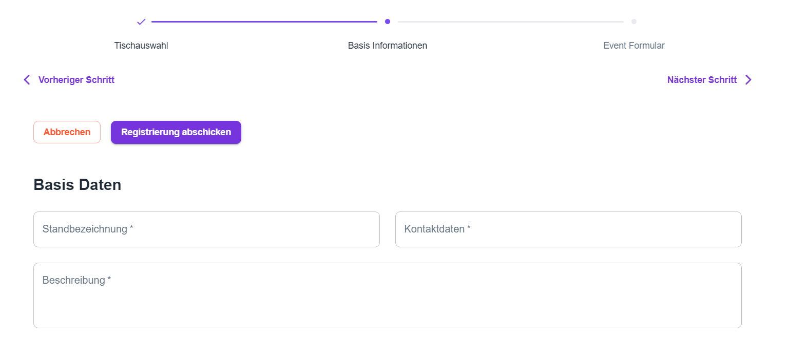
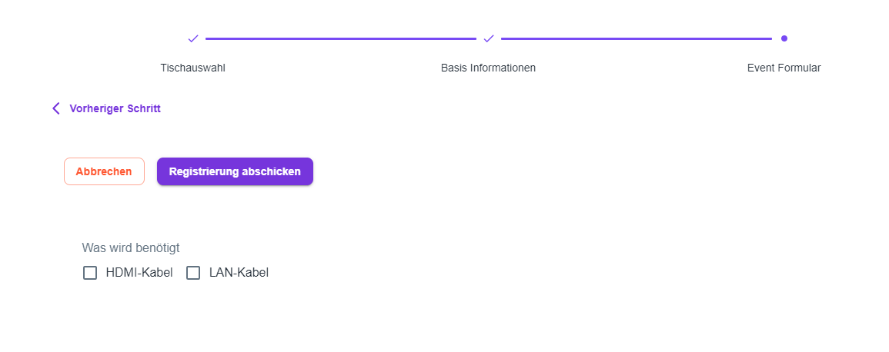

# Ree(n)vent - Projekt Eventplanungssystem

## Introduction

### What is your application doing?

Our application is an Event planning and registration platform.
It allows users to create events with a specific setup of tables in the event location.
Users can then register for those events and choose a table.
The application also allows all users to see all events with the events details.

### What is the functionality?

- **Create events:** Users can create events with a specific setup of tables in the event location. The event creator must also specify when and where the event takes place.
- **View events:** Users can view all events and see the details of each event.
- **Register for events:** Users can register for events and choose a table.
- **Register and Login:** Users can register and login to the application.

### Here are some screenshots:

#### Screenshots:

##### Login / Registration:




##### Event Overview:




##### Event Creation:






##### Event Registration:







## Architecture

### How did you set up the architecture and why?

- We use docker to run the application and the database. It was easy to set up and allows us to run the application on any machine.
- We use Next.js as our frontend and backend framework. It allows us to use React and typescript and also allows us to use server side rendering. Also, the folder based routing is very easy to use. We also use the Next.js api routes to create our backend.
- We use prisma as our ORM. It allows us to easily create and manage our database schema and also allows us to easily generate a prisma client to communicate with the database.
- We use postgres as our database. It is a relational database and allows us to easily store our data. Also, it is easy to set up and run with docker.
- We use redux as our state management library. It allows us to easily manage the state of our application and also allows us to easily persist the state of our application.
- We use MUI as our UI library. It allows us to easily create a good-looking UI and also allows us to easily create responsive UIs.
- We use JWT for authentication. It allows us to easily authenticate users and also allows us to easily create protected routes.

### What services are you using and for why?

Everything runs locally on our machines. We use docker to run the application and the database.

### How does your application scale?

Our application is a monolith and does not scale with extra instances. But each hosting institution can run their own instance of the application with our easy to set up docker compose file.

### What does your data model look like?

We use a relational database with the following schema:

```prisma
model User {
  username           String              @id @unique
  password           String
  email              String?             @unique
  imageUrl           String?
  firstName          String
  lastName           String
  organizedEvents    Event[]
  eventRegistrations EventRegistration[]
}

model Event {
  id                   Int                 @id @default(autoincrement())
  eventname            String
  organizer            User                @relation(fields: [organizerUsername], references: [username])
  organizerUsername    String
  startTime            DateTime            @db.Timestamptz(3)
  endTime              DateTime            @db.Timestamptz(3)
  roomGeometry         Json
  description          String?
  registrationFormular Json
  invitationCode       String?             @unique
  status               eventStatus         @default(DRAFT)
  imageUrl             String?
  adress               String
  zip                  String
  city                 String
  country              String
  contactInformation   String?
  tables               Table[]
  eventRegistrations   EventRegistration[]
}

model Table {
  id                Int                @id @default(autoincrement())
  event             Event              @relation(fields: [eventId], references: [id])
  eventId           Int
  capacity          Int
  origin            Float[]
  rotation          Float
  publicId          String
  EventRegistration EventRegistration?

  @@unique([eventId, publicId])
}

model EventRegistration {
  id                    Int                @id @default(autoincrement())
  table                 Table              @relation(fields: [tableId], references: [id])
  tableId               Int                @unique
  event                 Event              @relation(fields: [eventId], references: [id])
  eventId               Int
  mainExhibitor         User               @relation(fields: [mainExhibitorUsername], references: [username])
  mainExhibitorUsername String
  name                  String
  description           String?
  contactInformation    String?
  formularAnswers       Json
  status                registrationStatus @default(PENDING)
  submitTime            DateTime           @default(now()) @db.Timestamptz(3)
}

enum eventStatus {
  DRAFT
  OPEN
  ONGOING
  CLOSED
}

enum registrationStatus {
  PENDING
  ACCEPTED
}
```


### What APIs does your app expose?

**Our application currently does not expose any APIs.**
The plan was to expose a REST API for event organizers, 
but sadly we did not have enough time to implement this feature. 
The API would have allowed event organizers to create events and manage their events, 
get all registrations for an event and manage them. 
*This feature can be implemented in the future.*

### How does the communication between all components work?

- The communication between the frontend and the backend are done via internal API routes for the communication between backend and frontend in Next.js. 
- Communication for authentication is done via jwt in our middleware. 
- Communication between the api routes (server side of Next.js) and the database is done via the prisma client.

## Tooling

### How does a developer work on your application?

#### Starting the application
1. Clone the repository
2. Run `npm install` in the next folder
3. Run the Docker container:
   - For a development setup: Run `docker-compose up` in the root folder
   - For a production setup: Run `docker-compose -f docker-compose.prod.yml up` in the root folder
   - add `-d` to run the container in the background
   - Use `docker compose build` to rebuild the container (this is needed when you change used packages or regenerate the prisma client, do this on your first run)
4. Open the application in your browser at `localhost:3000`
5. To stop the container, run `docker-compose down` in the root folder

#### Using prisma and prisma migrate to setup / update the database
1. Have the docker container running
2. PLEASE MAKE SURE THAT YOU CHANGE OUT THE PASSWORD IN THE `docker-compose.yml` FILE TO SOMETHING SECURE AND ALSO CHANGE IT IN THE `next/.env` FILE (in both URLS)
3. Changeout the environment-variable `DATABASE_URL` in the `next/.env` file to point to the `localhost` database
4. Either:
    - Run `npx prisma migrate deploy` in the `next` folder to apply all missing migrations to the database
    - Run `npx prisma migrate dev` in the `next` folder to create a new migration and apply it to the database
5. Run `npx prisma generate` in the `next` folder to generate the prisma client
6. Changeout the environment-variable `DATABASE_URL` in the `next/.env` file to point to the `postgres` database (the internal docker URL)
7. Shut down the docker container, rebuild it and start it again

### What does the docker stack look like?

- Docker (with docker compose)
    - Container postgres (database)
    - Container next (front- and backend)
    - Container adminer (database management, only in development)

### How are code changes deployed?

Every developer can run the application locally on their machine with docker compose. 
When there are breaking changes (new packages or a database migration) the developer has to rebuild the docker container.

When the application is ready for production, the docker container can be deployed to a server.

### How is your infrastructure automated?

Our infrastructure is not automated.

### How does your build pipeline look like?

Currently, we do not have a build pipeline. Developers can run the application locally on their machine with docker compose.

## Lessons Learned

### What have you learned?

- **Time management is important:** We learned that time management is very important. We had a lot of features we wanted to implement, but we did not have enough time to implement all of them. We also had to cut some features because we did not have enough time to implement them.
- **Communication is important:** We learned that communication is very important. We had some problems with communication in the middle of the project because of lacking motivation of all team members, but we learned from our mistakes and improved our communication towards the end.
- **Implement blocking features first and with high priority:** We learned that it is important to implement blocking features first and with high priority. We had some problems with implementing the authentication and authorization, and we had to cut some features because of that. We learned that it is important to implement blocking features first and with high priority to avoid problems like that.

### What was easy? What was complicated?

#### Easy

- **Prisma:** Prisma was very easy to use. It allowed us to easily create and manage our database schema and also allowed us to easily generate a prisma client to communicate with the database. Also, a big plus was the superior documentation. Having a good documentation is very important for a library and because of that using prisma for the first time was easy, fast and fun.
- **i18n:** i18n was very easy to use. It allowed us to easily translate our application and also allowed us to easily add new languages. 
- **MUI:** MUI was very easy to use. It allowed us to easily create a good-looking UI and also allowed us to easily create responsive UIs. MUI also has a lot of components and examples which made it easy to use. The documentation was also very good.
- **Docker:** Setting up the architecture with docker was very easy. It allowed us to easily run the application and the database on any machine. Also, the docker compose file was very easy to set up and use.

#### Complicated

- **Next.js:**
  - **Documentation:** The documentation of Next.js was horrible. It was very hard to find information we needed on specific subjects. Examples were sparse and only contained in a mono repo with all other examples. The documentation also did not always reflect breaking changes in the Next.js library and because of that we had to spend a lot of time to find out why our application was not working. Sometimes you could only find information in old GitHub issues which did not get any attention of the Next.js team. The documentation also did not always reflect the current state of the library and because of that we had to spend a lot of time to find out why our application was not working. Sometimes you could only find information in old GitHub issues which did not get any attention of the Next.js team.
  - **Runtimes:** Next.js uses three (3!) different runtimes:
    - **Server side:** The server side runtime is used for the server side rendering of the application, server side code (like database access) etc. This runtime works as expected, but you cant access this runtime from the client runtime directly and need to always use a different way (API route, server component, server action) when you want to access it.
    - **Client side:** The client side runtime is used for the client side rendering of the application and runs in the users browser. Here we can use React and all react features like hooks etc. This runtime works as expected, but cannot access the server side runtime directly.
    - **Edge runtime:** The edge runtime is used in a few specific cases. In our case this was the middleware. This runtime is intended to be deployed on Vercel edge functions, so nearly no documentation for using this in a local context exists. Variables of the server side runtime are not available in the edge runtime (which is not documented very well) and a lot of node packages don't work in the edge runtime because they use node specific functions which the edge runtime does not support. We had to spend a lot of time to find out why our middleware was not working and how to fix it.
  - **Separation of concerns:** By using Next.js as our front- and backend framework we did not separate our concerns very well. It often happened that we wanted to use a server side feature in our client side code. It would have been better if we used a separate server  (for example express, spring etc.) for our backend. We realized this late in the project and had not enough time to change it.
  - **Load times:** Starting the application in development mode takes at least half a minute. This is very annoying when you want to test something. Also, the hot reload function of next does not work in the dockerized version of our application, so we had to restart the application every time we wanted to test something. This made developing a quite a bit more annoying.
- **Prisma:** Getting the grip on prisma was a bit hard at the start. It wasn't as bad as Next.js (because prisma actually has documentation), but it still took some time to get used to it. Especially the way relations are represented in the prisma schema and client can be a bit odd at the start.
- **Docker:** Docker sometimes throws some ***weird*** errors. It is not always easy to find out why the error is thrown and how to fix it. One team member had to re-setup or project multiple times because of that. Also, we didn't find a way to make the hot reload function of next available in the dockerized version of our app. This made developing a quite a bit more annoying.


### Have you been surprised by anything?

- **Next.js:** We were surprised by the bad documentation of Next.js. We expected a good documentation because Next.js is a very popular framework, but the documentation was horrible.
- **Prisma:** We were surprised by the speed you can prototype your database with prisma. The first version of our database was created in less than 30 minutes.
- **JWT:** We were surprised by how easy it is to use JWT for authentication. We expected it to be a lot harder to use JWT for authentication, but it was very easy to use.
